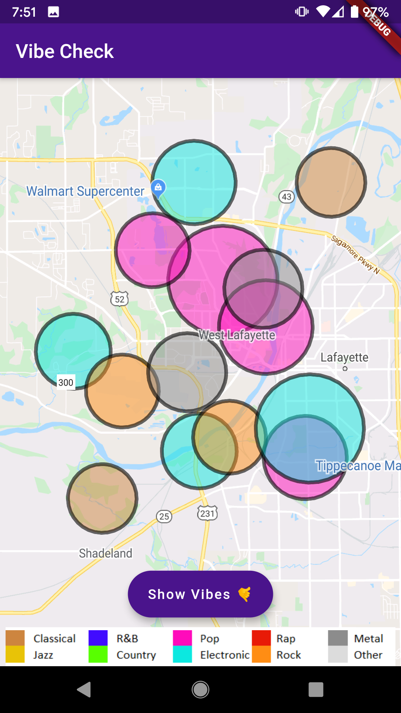
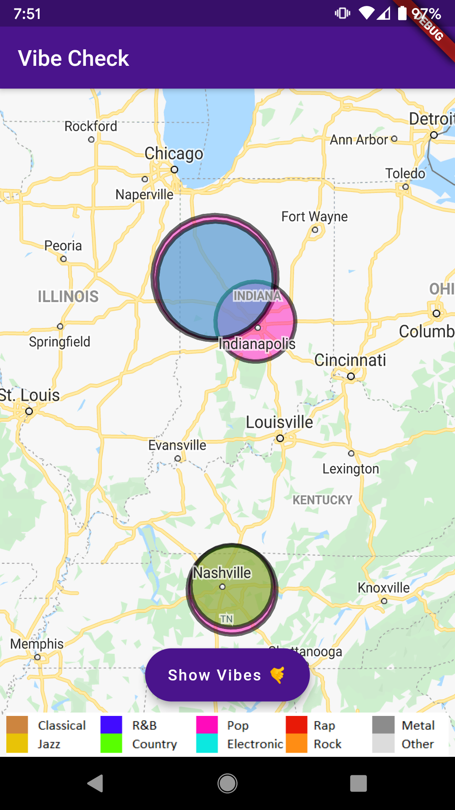
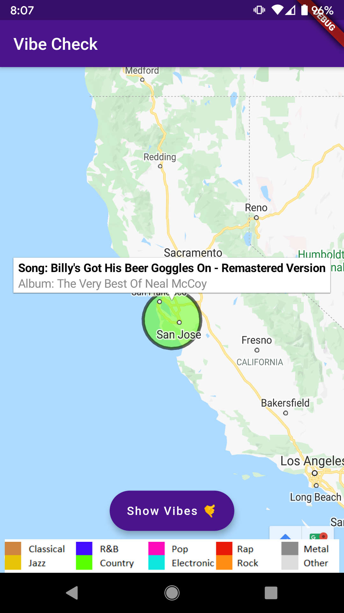
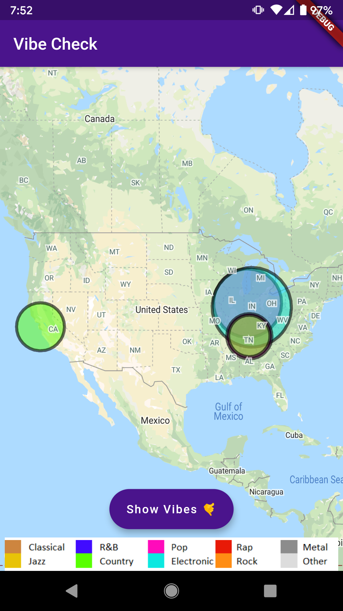

# vibe-check #

Mobile application for vibe-check.






## API Keys ##

Add your Google Maps API keys:

1. Create `secrets.ps1` for PowerShell:
```powershell
${ENV:MAPS_IOS_API_KEY}=''
${ENV:MAPS_ANDROID_API_KEY}=''
```

2. Create `secrets.sh` for Bash:
```bash
export MAPS_IOS_API_KEY=
export MAPS_ANDROID_API_KEY=
```

3. Source the scripts (`./secrets.ps1` or `source ./secrets.sh`) before running `flutter run`.


## Getting Started ##

A few resources to get you started if this is your first Flutter project:

- [Lab: Write your first Flutter app](https://flutter.dev/docs/get-started/codelab)
- [Cookbook: Useful Flutter samples](https://flutter.dev/docs/cookbook)

For help getting started with Flutter, view our
[online documentation](https://flutter.dev/docs), which offers tutorials,
samples, guidance on mobile development, and a full API reference.
